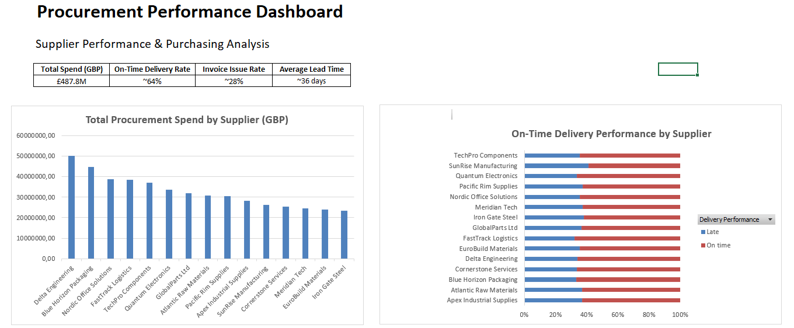
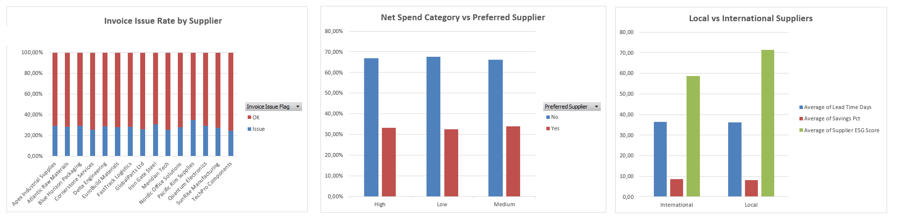

# 📊 Procurement Performance Analysis Dashboard
## 📌 Project Overview
This project presents a procurement performance analysis created in Microsoft Excel using pivot tables, calculated columns, KPIs, and dashboard visualizations.
The goal of the project was to analyze supplier performance and identify operational issues in the purchasing process using simulated procurement data.
The final result is a procurement dashboard focused on:
- supplier spend,
- delivery performance,
- invoice issues,
- and supplier comparison.

---
## 🎯 Business Problem
The company wants to improve supplier performance and reduce operational problems in the procurement process.

The analysis focuses on:
- delivery delays,
- invoice issues,
- procurement efficiency,
- and supplier reliability.

---
## ❓ Main Analytical Question

Which suppliers create the biggest operational challenges in the procurement process?

---
## 📋 Guiding Business Questions

1. Which suppliers generate the highest procurement spend?
2. Which suppliers have the highest percentage of late deliveries?
3. Which suppliers generate the highest invoice issue rates?
4. Do preferred suppliers perform differently across spend categories?
5. Are there differences between local and international suppliers?

---
## 📁 Dataset Information

- Source: simulated procurement dataset
- Tool used: Microsoft Excel
- Dataset size: approximately 5,000 records
- Data type: fictional business data created for educational purposes

The original dataset contained many procurement-related variables.  
For the final analysis, only the most relevant columns were selected and used in the dashboard.

---
## 🧹 Data Preparation

Several data-cleaning steps were performed before the analysis:

- date columns were converted from text format into proper Excel date values,
- numeric columns were validated,
- duplicate PO Numbers were checked,
- lead time values were verified.

The dataset contained multiple currencies.  
Because GBP was the most frequently used currency in the dataset, the final procurement spend analysis was limited to GBP transactions only.

The spend analysis was based on net values (`Line Net`) instead of tax-inclusive values.

---
## ➕ Additional Calculated Columns

Several helper columns were created to support the analysis.

### 1. Delivery Performance Flag

This column classifies deliveries as:
- On time
- Late

based on delivery delays.

---

### 2. Net Spend Category

This column groups transactions into:
- Low
- Medium
- High

based on Line Net values.

---

### 3. Invoice Issue Flag

This column classifies invoices as:
- Issue
- OK

based on invoice-related problems.

---
### 4. Local vs International Supplier

This column groups suppliers into:
- Local
- International

to compare supplier performance by supplier type.

---

## 📈 Dashboard KPIs

The dashboard includes four main KPIs:

- Total Spend (GBP)
- On-Time Delivery Rate
- Invoice Issue Rate
- Average Lead Time

---
## 📊 Dashboard Visualizations

The final dashboard contains the following visualizations:

- Total Procurement Spend by Supplier
- On-Time Delivery Performance by Supplier
- Invoice Issue Rate by Supplier
- Net Spend Category vs Preferred Supplier
- Local vs International Suppliers

---
## 🔍 Key Insights

### 1. Procurement spend is concentrated among several suppliers

A relatively small group of suppliers generates the largest share of procurement spend.

### 2. Supplier delivery performance is relatively stable

Most suppliers achieved similar on-time delivery rates.

### 3. Invoice issue rates are similar across suppliers

No supplier showed extremely high invoice issue rates compared to others.

### 4. Preferred suppliers do not significantly outperform other suppliers

The analysis showed only small differences between preferred and non-preferred suppliers.

### 5. Local suppliers achieved higher ESG scores

Local suppliers showed higher average ESG scores than international suppliers.

---

## 🛠 Tools & Skills Used

### Tools
- Microsoft Excel
- Pivot Tables
- Pivot Charts
- Dashboard Design

### Skills
- Data Cleaning
- Data Transformation
- Procurement Analysis
- KPI Reporting
- Data Visualization
- Business Analysis

---

## ✅ Project Outcome

The project demonstrates practical Excel analytics skills, including:
- data preparation,
- business analysis,
- KPI creation,
- dashboard development,
- and procurement performance analysis.

---
## 📷 Dashboard Preview

## ⚠ Disclaimer

This project uses simulated data created for educational and portfolio purposes only.

---
